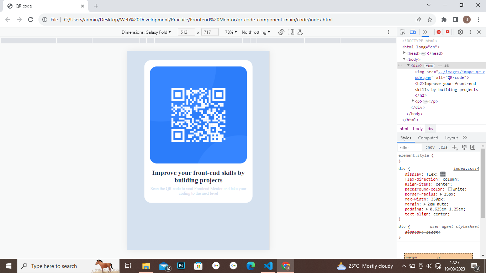

# Frontend Mentor - QR code component solution

This is a solution to the [QR code component challenge on Frontend Mentor](https://www.frontendmentor.io/challenges/qr-code-component-iux_sIO_H). Frontend Mentor challenges help you improve your coding skills by building realistic projects. 

## Table of contents

- [Overview](#overview)
  - [Screenshot](#screenshot)
  - [Links](#links)
- [My process](#my-process)
  - [Built with](#built-with)
  - [What I learned](#what-i-learned)
  - [Continued development](#continued-development)
  - [Useful resources](#useful-resources)
- [Author](#author)
- [Acknowledgments](#acknowledgments)

## Overview

### Screenshot

### Links

- Solution URL: (https://your-solution-url.com)](https://github.com/PixelBerry2/Frontend-Mentor/edit/main/qr-code-component-main)
- Live Site URL: (https://qr-code-layout.netlify.app/)

## My process

### Built with

- Semantic HTML5 markup
- CSS custom properties
- Flexbox

### What I learned

I got to practice the basics of creating layouts using Flexbox, centering elements using margin and using variable units such as em and percentages to make the design more responsive

To see how you can add code snippets, see below:

### Useful resources

- MDN Docs [https://developer.mozilla.org/en-US/]: This helped me get the correct syntax of some HTML properties a

## Author

- Frontend Mentor - [PixelBerry2][(https://www.frontendmentor.io/profile/PixelBerry2)]

